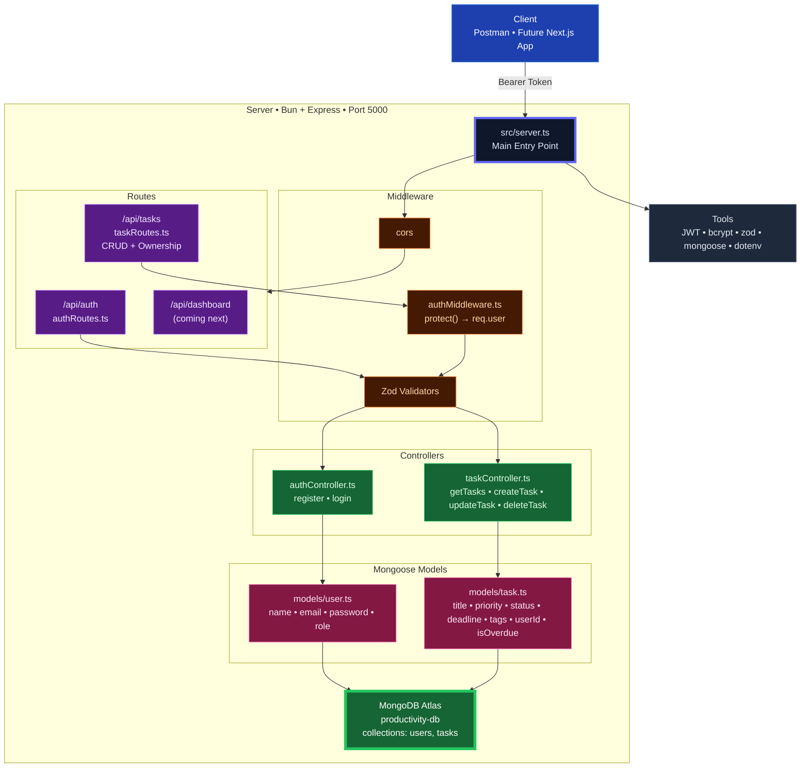

# Productivity API  
**Full-Stack Productivity Tracker**

Live, secure, cloud-connected backend powering task management & deep productivity insights.

### Tech Stack 
- **Runtime**: Bun
- **Language**: TypeScript (strict)
- **Framework**: Express.js
- **Database**: MongoDB Atlas (cloud)
- **Auth**: JWT + bcrypt
- **Validation**: Zod (TypeScript-first)
- **Architecture**: Clean, Scalable, Production-Ready

### Architecture

