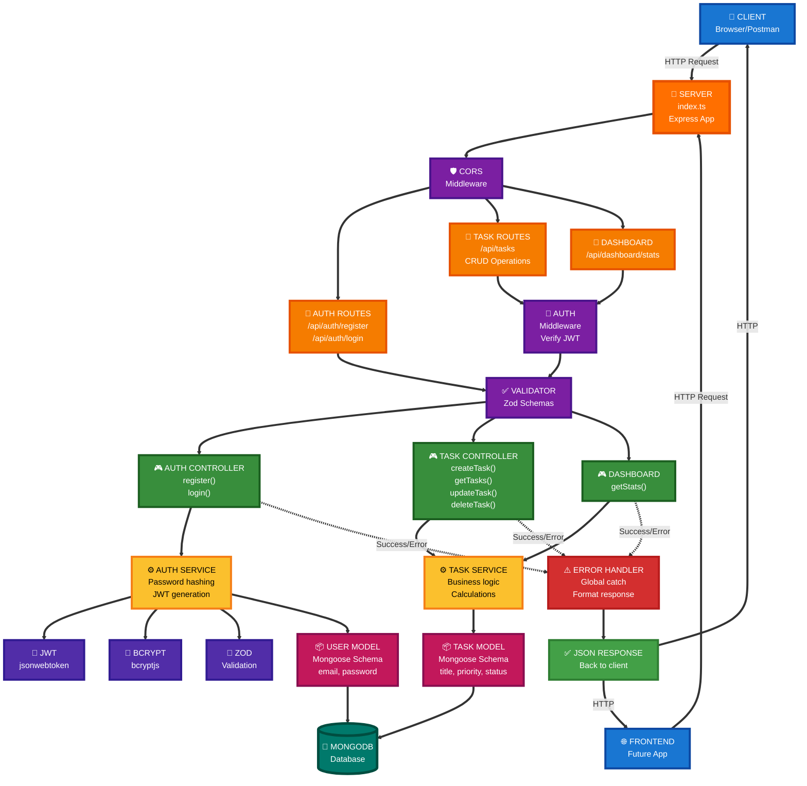

```mermaid
flowchart TD
    Client["👤 CLIENT<br/>Browser/Postman"]
    Frontend["🌐 FRONTEND<br/>Future App"]
    
    Server["🚀 SERVER<br/>index.ts<br/>Express App"]
    
    CORS["🛡️ CORS<br/>Middleware"]
    
    AuthRoute["📍 AUTH ROUTES<br/>/api/auth/register<br/>/api/auth/login"]
    TaskRoute["📍 TASK ROUTES<br/>/api/tasks<br/>CRUD Operations"]
    DashRoute["📍 DASHBOARD<br/>/api/dashboard/stats"]
    
    AuthMW["🔐 AUTH<br/>Middleware<br/>Verify JWT"]
    ValidMW["✅ VALIDATOR<br/>Zod Schemas"]
    
    AuthCtrl["🎮 AUTH CONTROLLER<br/>register()<br/>login()"]
    TaskCtrl["🎮 TASK CONTROLLER<br/>createTask()<br/>getTasks()<br/>updateTask()<br/>deleteTask()"]
    DashCtrl["🎮 DASHBOARD<br/>getStats()"]
    
    AuthServ["⚙️ AUTH SERVICE<br/>Password hashing<br/>JWT generation"]
    TaskServ["⚙️ TASK SERVICE<br/>Business logic<br/>Calculations"]
    
    UserModel["📦 USER MODEL<br/>Mongoose Schema<br/>email, password"]
    TaskModel["📦 TASK MODEL<br/>Mongoose Schema<br/>title, priority, status"]
    
    MongoDB[("💾 MONGODB<br/>Database")]
    
    JWT["🔧 JWT<br/>jsonwebtoken"]
    Bcrypt["🔧 BCRYPT<br/>bcryptjs"]
    Zod["🔧 ZOD<br/>Validation"]
    
    ErrorHandler["⚠️ ERROR HANDLER<br/>Global catch<br/>Format response"]
    
    Response["✅ JSON RESPONSE<br/>Back to client"]
    
    Client ==>|HTTP Request| Server
    Frontend ==>|HTTP Request| Server
    
    Server ==> CORS
    CORS ==> AuthRoute
    CORS ==> TaskRoute
    CORS ==> DashRoute
    
    AuthRoute ==> ValidMW
    TaskRoute ==> AuthMW
    DashRoute ==> AuthMW
    
    AuthMW ==> ValidMW
    
    ValidMW ==> AuthCtrl
    ValidMW ==> TaskCtrl
    ValidMW ==> DashCtrl
    
    AuthCtrl ==> AuthServ
    TaskCtrl ==> TaskServ
    DashCtrl ==> TaskServ
    
    AuthServ --> JWT
    AuthServ --> Bcrypt
    AuthServ --> Zod
    
    AuthServ ==> UserModel
    TaskServ ==> TaskModel
    
    UserModel ==> MongoDB
    TaskModel ==> MongoDB
    
    AuthCtrl -.->|Success/Error| ErrorHandler
    TaskCtrl -.->|Success/Error| ErrorHandler
    DashCtrl -.->|Success/Error| ErrorHandler
    
    ErrorHandler ==> Response
    Response ==>|HTTP| Client
    Response ==>|HTTP| Frontend
    
    linkStyle default stroke:#333,stroke-width:4px

    style Client fill:#1976d2,stroke:#0d47a1,stroke-width:4px,color:#fff
    style Frontend fill:#1976d2,stroke:#0d47a1,stroke-width:4px,color:#fff
    style Server fill:#ff6f00,stroke:#e65100,stroke-width:5px,color:#fff
    style CORS fill:#7b1fa2,stroke:#4a148c,stroke-width:4px,color:#fff
    style AuthRoute fill:#f57c00,stroke:#e65100,stroke-width:4px,color:#fff
    style TaskRoute fill:#f57c00,stroke:#e65100,stroke-width:4px,color:#fff
    style DashRoute fill:#f57c00,stroke:#e65100,stroke-width:4px,color:#fff
    style AuthMW fill:#7b1fa2,stroke:#4a148c,stroke-width:4px,color:#fff
    style ValidMW fill:#7b1fa2,stroke:#4a148c,stroke-width:4px,color:#fff
    style AuthCtrl fill:#388e3c,stroke:#1b5e20,stroke-width:4px,color:#fff
    style TaskCtrl fill:#388e3c,stroke:#1b5e20,stroke-width:4px,color:#fff
    style DashCtrl fill:#388e3c,stroke:#1b5e20,stroke-width:4px,color:#fff
    style AuthServ fill:#fbc02d,stroke:#f57f17,stroke-width:4px,color:#000
    style TaskServ fill:#fbc02d,stroke:#f57f17,stroke-width:4px,color:#000
    style UserModel fill:#c2185b,stroke:#880e4f,stroke-width:4px,color:#fff
    style TaskModel fill:#c2185b,stroke:#880e4f,stroke-width:4px,color:#fff
    style MongoDB fill:#00796b,stroke:#004d40,stroke-width:5px,color:#fff
    style JWT fill:#512da8,stroke:#311b92,stroke-width:4px,color:#fff
    style Bcrypt fill:#512da8,stroke:#311b92,stroke-width:4px,color:#fff
    style Zod fill:#512da8,stroke:#311b92,stroke-width:4px,color:#fff
    style ErrorHandler fill:#d32f2f,stroke:#b71c1c,stroke-width:4px,color:#fff
    style Response fill:#43a047,stroke:#2e7d32,stroke-width:4px,color:#fff
```
