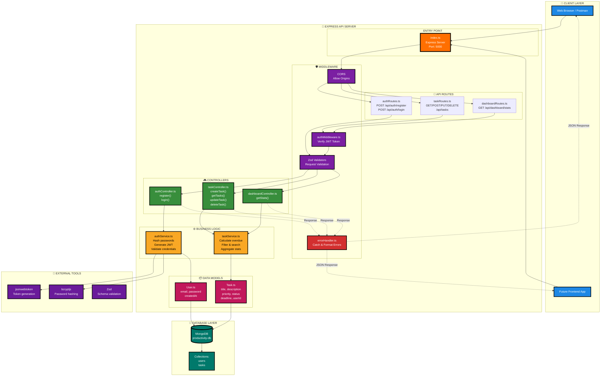

```mermaid
graph TB
    subgraph Client["👤 CLIENT LAYER"]
        Browser["Web Browser / Postman"]
        Frontend["Future Frontend App"]
    end

    subgraph API["🚀 EXPRESS API SERVER"]
        direction TB
        
        subgraph Entry["ENTRY POINT"]
            Server["index.ts<br/>Express Server<br/>Port: 5000"]
        end
        
        subgraph Routing["📍 API ROUTES"]
            AuthRoutes["authRoutes.ts<br/>POST /api/auth/register<br/>POST /api/auth/login"]
            TaskRoutes["taskRoutes.ts<br/>GET/POST/PUT/DELETE<br/>/api/tasks"]
            DashboardRoutes["dashboardRoutes.ts<br/>GET /api/dashboard/stats"]
        end
        
        subgraph MW["🛡️ MIDDLEWARE"]
            CORS["CORS<br/>Allow Origins"]
            Auth["authMiddleware.ts<br/>Verify JWT Token"]
            Validator["Zod Validators<br/>Request Validation"]
            ErrorHandler["errorHandler.ts<br/>Catch & Format Errors"]
        end
        
        subgraph Controllers["🎮 CONTROLLERS"]
            AuthCtrl["authController.ts<br/>register()<br/>login()"]
            TaskCtrl["taskController.ts<br/>createTask()<br/>getTasks()<br/>updateTask()<br/>deleteTask()"]
            DashCtrl["dashboardController.ts<br/>getStats()"]
        end
        
        subgraph Services["⚙️ BUSINESS LOGIC"]
            AuthService["authService.ts<br/>Hash passwords<br/>Generate JWT<br/>Validate credentials"]
            TaskService["taskService.ts<br/>Calculate overdue<br/>Filter & search<br/>Aggregate stats"]
        end
        
        subgraph Models["📦 DATA MODELS"]
            UserModel["User.ts<br/>email, password<br/>createdAt"]
            TaskModel["Task.ts<br/>title, description<br/>priority, status<br/>deadline, userId"]
        end
    end

    subgraph Database["💾 DATABASE LAYER"]
        MongoDB[(MongoDB<br/>productivity-db)]
        Collections["Collections:<br/>users<br/>tasks"]
    end

    subgraph External["🔧 EXTERNAL TOOLS"]
        JWT["jsonwebtoken<br/>Token generation"]
        Bcrypt["bcryptjs<br/>Password hashing"]
        Zod["Zod<br/>Schema validation"]
    end

    Browser --> Server
    Frontend --> Server
    
    Server --> CORS
    CORS --> AuthRoutes
    CORS --> TaskRoutes
    CORS --> DashboardRoutes
    
    AuthRoutes --> Validator
    TaskRoutes --> Auth
    DashboardRoutes --> Auth
    
    Auth --> Validator
    Validator --> AuthCtrl
    Validator --> TaskCtrl
    Validator --> DashCtrl
    
    AuthCtrl --> AuthService
    TaskCtrl --> TaskService
    DashCtrl --> TaskService
    
    AuthService --> JWT
    AuthService --> Bcrypt
    AuthService --> UserModel
    TaskService --> TaskModel
    
    UserModel --> MongoDB
    TaskModel --> MongoDB
    MongoDB --> Collections
    
    TaskCtrl -.Response.-> ErrorHandler
    AuthCtrl -.Response.-> ErrorHandler
    DashCtrl -.Response.-> ErrorHandler
    
    ErrorHandler -.JSON Response.-> Browser
    ErrorHandler -.JSON Response.-> Frontend

    style Browser fill:#1e88e5,stroke:#000,stroke-width:3px,color:#fff
    style Frontend fill:#1e88e5,stroke:#000,stroke-width:3px,color:#fff
    style Server fill:#ff6f00,stroke:#000,stroke-width:4px,color:#fff
    style CORS fill:#7b1fa2,stroke:#000,stroke-width:3px,color:#fff
    style Auth fill:#7b1fa2,stroke:#000,stroke-width:3px,color:#fff
    style Validator fill:#7b1fa2,stroke:#000,stroke-width:3px,color:#fff
    style ErrorHandler fill:#d32f2f,stroke:#000,stroke-width:3px,color:#fff
    style AuthCtrl fill:#388e3c,stroke:#000,stroke-width:3px,color:#fff
    style TaskCtrl fill:#388e3c,stroke:#000,stroke-width:3px,color:#fff
    style DashCtrl fill:#388e3c,stroke:#000,stroke-width:3px,color:#fff
    style AuthService fill:#f9a825,stroke:#000,stroke-width:3px,color:#000
    style TaskService fill:#f9a825,stroke:#000,stroke-width:3px,color:#000
    style UserModel fill:#c2185b,stroke:#000,stroke-width:3px,color:#fff
    style TaskModel fill:#c2185b,stroke:#000,stroke-width:3px,color:#fff
    style MongoDB fill:#00796b,stroke:#000,stroke-width:4px,color:#fff
    style Collections fill:#00796b,stroke:#000,stroke-width:3px,color:#fff
    style JWT fill:#6a1b9a,stroke:#000,stroke-width:3px,color:#fff
    style Bcrypt fill:#6a1b9a,stroke:#000,stroke-width:3px,color:#fff
    style Zod fill:#6a1b9a,stroke:#000,stroke-width:3px,color:#fff
```