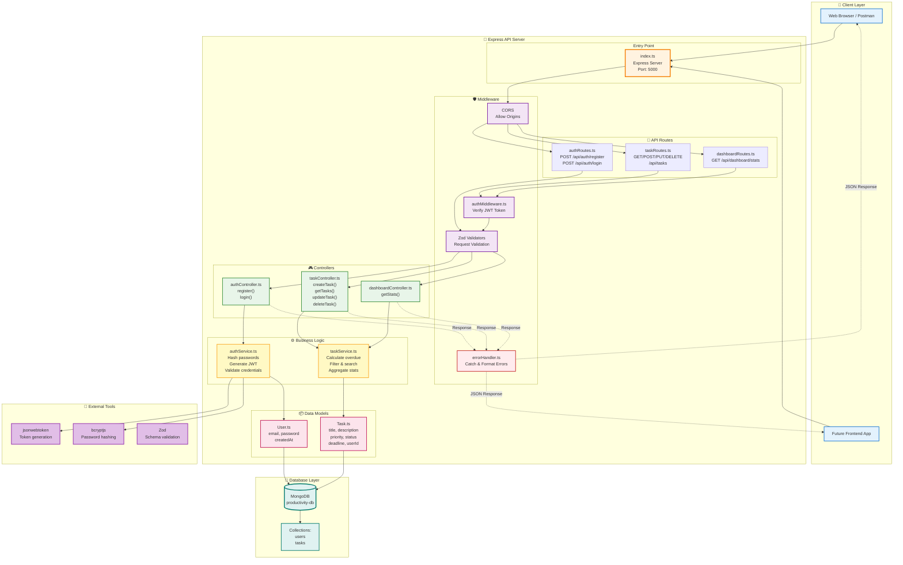

```mermaid
graph TB
    subgraph Client["👤 Client Layer"]
        Browser["Web Browser / Postman"]
        Frontend["Future Frontend App"]
    end

    subgraph API["🚀 Express API Server"]
        direction TB
        
        subgraph Entry["Entry Point"]
            Server["index.ts<br/>Express Server<br/>Port: 5000"]
        end
        
        subgraph Routing["📍 API Routes"]
            AuthRoutes["authRoutes.ts<br/>POST /api/auth/register<br/>POST /api/auth/login"]
            TaskRoutes["taskRoutes.ts<br/>GET/POST/PUT/DELETE<br/>/api/tasks"]
            DashboardRoutes["dashboardRoutes.ts<br/>GET /api/dashboard/stats"]
        end
        
        subgraph MW["🛡️ Middleware"]
            CORS["CORS<br/>Allow Origins"]
            Auth["authMiddleware.ts<br/>Verify JWT Token"]
            Validator["Zod Validators<br/>Request Validation"]
            ErrorHandler["errorHandler.ts<br/>Catch & Format Errors"]
        end
        
        subgraph Controllers["🎮 Controllers"]
            AuthCtrl["authController.ts<br/>register()<br/>login()"]
            TaskCtrl["taskController.ts<br/>createTask()<br/>getTasks()<br/>updateTask()<br/>deleteTask()"]
            DashCtrl["dashboardController.ts<br/>getStats()"]
        end
        
        subgraph Services["⚙️ Business Logic"]
            AuthService["authService.ts<br/>Hash passwords<br/>Generate JWT<br/>Validate credentials"]
            TaskService["taskService.ts<br/>Calculate overdue<br/>Filter & search<br/>Aggregate stats"]
        end
        
        subgraph Models["📦 Data Models"]
            UserModel["User.ts<br/>email, password<br/>createdAt"]
            TaskModel["Task.ts<br/>title, description<br/>priority, status<br/>deadline, userId"]
        end
    end

    subgraph Database["💾 Database Layer"]
        MongoDB[(MongoDB<br/>productivity-db)]
        Collections["Collections:<br/>users<br/>tasks"]
    end

    subgraph External["🔧 External Tools"]
        JWT["jsonwebtoken<br/>Token generation"]
        Bcrypt["bcryptjs<br/>Password hashing"]
        Zod["Zod<br/>Schema validation"]
    end

    Browser --> Server
    Frontend --> Server
    
    Server --> CORS
    CORS --> AuthRoutes
    CORS --> TaskRoutes
    CORS --> DashboardRoutes
    
    AuthRoutes --> Validator
    TaskRoutes --> Auth
    DashboardRoutes --> Auth
    
    Auth --> Validator
    Validator --> AuthCtrl
    Validator --> TaskCtrl
    Validator --> DashCtrl
    
    AuthCtrl --> AuthService
    TaskCtrl --> TaskService
    DashCtrl --> TaskService
    
    AuthService --> JWT
    AuthService --> Bcrypt
    AuthService --> UserModel
    TaskService --> TaskModel
    
    UserModel --> MongoDB
    TaskModel --> MongoDB
    MongoDB --> Collections
    
    TaskCtrl -.Response.-> ErrorHandler
    AuthCtrl -.Response.-> ErrorHandler
    DashCtrl -.Response.-> ErrorHandler
    
    ErrorHandler -.JSON Response.-> Browser
    ErrorHandler -.JSON Response.-> Frontend

    style Browser fill:#e3f2fd,stroke:#1976d2,stroke-width:2px
    style Frontend fill:#e3f2fd,stroke:#1976d2,stroke-width:2px
    style Server fill:#fff3e0,stroke:#f57c00,stroke-width:3px
    style CORS fill:#f3e5f5,stroke:#7b1fa2,stroke-width:2px
    style Auth fill:#f3e5f5,stroke:#7b1fa2,stroke-width:2px
    style Validator fill:#f3e5f5,stroke:#7b1fa2,stroke-width:2px
    style ErrorHandler fill:#ffebee,stroke:#c62828,stroke-width:2px
    style AuthCtrl fill:#e8f5e9,stroke:#388e3c,stroke-width:2px
    style TaskCtrl fill:#e8f5e9,stroke:#388e3c,stroke-width:2px
    style DashCtrl fill:#e8f5e9,stroke:#388e3c,stroke-width:2px
    style AuthService fill:#fff9c4,stroke:#f9a825,stroke-width:2px
    style TaskService fill:#fff9c4,stroke:#f9a825,stroke-width:2px
    style UserModel fill:#fce4ec,stroke:#c2185b,stroke-width:2px
    style TaskModel fill:#fce4ec,stroke:#c2185b,stroke-width:2px
    style MongoDB fill:#e0f2f1,stroke:#00796b,stroke-width:3px
    style Collections fill:#e0f2f1,stroke:#00796b,stroke-width:2px
    style JWT fill:#e1bee7,stroke:#8e24aa,stroke-width:2px
    style Bcrypt fill:#e1bee7,stroke:#8e24aa,stroke-width:2px
    style Zod fill:#e1bee7,stroke:#8e24aa,stroke-width:2px
```