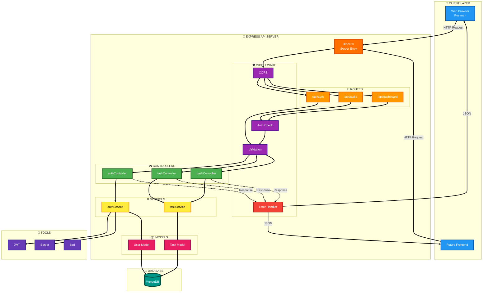

```mermaid
graph TB
    subgraph Client["👤 CLIENT LAYER"]
        Browser["Web Browser<br/>Postman"]
        Frontend["Future Frontend"]
    end

    subgraph API["🚀 EXPRESS API SERVER"]
        direction TB
        
        Server["index.ts<br/>Server Entry"]
        
        subgraph Routes["📍 ROUTES"]
            AuthR["/api/auth"]
            TaskR["/api/tasks"]
            DashR["/api/dashboard"]
        end
        
        subgraph Middle["🛡️ MIDDLEWARE"]
            CORS["CORS"]
            Auth["Auth Check"]
            Valid["Validation"]
            Error["Error Handler"]
        end
        
        subgraph Control["🎮 CONTROLLERS"]
            AuthC["authController"]
            TaskC["taskController"]
            DashC["dashController"]
        end
        
        subgraph Serv["⚙️ SERVICES"]
            AuthS["authService"]
            TaskS["taskService"]
        end
        
        subgraph Mod["📦 MODELS"]
            UserM["User Model"]
            TaskM["Task Model"]
        end
    end

    subgraph DB["💾 DATABASE"]
        Mongo[("MongoDB")]
    end

    subgraph Tools["🔧 TOOLS"]
        JWT["JWT"]
        Bcrypt["Bcrypt"]
        Zod["Zod"]
    end

    Browser ==>|HTTP Request| Server
    Frontend ==>|HTTP Request| Server
    
    Server ==> CORS
    CORS ==> AuthR
    CORS ==> TaskR
    CORS ==> DashR
    
    AuthR ==> Valid
    TaskR ==> Auth
    DashR ==> Auth
    
    Auth ==> Valid
    Valid ==> AuthC
    Valid ==> TaskC
    Valid ==> DashC
    
    AuthC ==> AuthS
    TaskC ==> TaskS
    DashC ==> TaskS
    
    AuthS --> JWT
    AuthS --> Bcrypt
    AuthS ==> UserM
    TaskS ==> TaskM
    
    UserM ==> Mongo
    TaskM ==> Mongo
    
    TaskC -.->|Response| Error
    AuthC -.->|Response| Error
    DashC -.->|Response| Error
    
    Error ==>|JSON| Browser
    Error ==>|JSON| Frontend

    linkStyle default stroke:#000,stroke-width:3px

    style Browser fill:#2196f3,stroke:#0d47a1,stroke-width:3px,color:#fff
    style Frontend fill:#2196f3,stroke:#0d47a1,stroke-width:3px,color:#fff
    style Server fill:#ff6f00,stroke:#e65100,stroke-width:4px,color:#fff
    style CORS fill:#9c27b0,stroke:#4a148c,stroke-width:3px,color:#fff
    style Auth fill:#9c27b0,stroke:#4a148c,stroke-width:3px,color:#fff
    style Valid fill:#9c27b0,stroke:#4a148c,stroke-width:3px,color:#fff
    style Error fill:#f44336,stroke:#b71c1c,stroke-width:3px,color:#fff
    style AuthC fill:#4caf50,stroke:#1b5e20,stroke-width:3px,color:#fff
    style TaskC fill:#4caf50,stroke:#1b5e20,stroke-width:3px,color:#fff
    style DashC fill:#4caf50,stroke:#1b5e20,stroke-width:3px,color:#fff
    style AuthS fill:#ffeb3b,stroke:#f57f17,stroke-width:3px,color:#000
    style TaskS fill:#ffeb3b,stroke:#f57f17,stroke-width:3px,color:#000
    style UserM fill:#e91e63,stroke:#880e4f,stroke-width:3px,color:#fff
    style TaskM fill:#e91e63,stroke:#880e4f,stroke-width:3px,color:#fff
    style Mongo fill:#009688,stroke:#004d40,stroke-width:4px,color:#fff
    style JWT fill:#673ab7,stroke:#311b92,stroke-width:3px,color:#fff
    style Bcrypt fill:#673ab7,stroke:#311b92,stroke-width:3px,color:#fff
    style Zod fill:#673ab7,stroke:#311b92,stroke-width:3px,color:#fff
    style AuthR fill:#ff9800,stroke:#e65100,stroke-width:3px,color:#fff
    style TaskR fill:#ff9800,stroke:#e65100,stroke-width:3px,color:#fff
    style DashR fill:#ff9800,stroke:#e65100,stroke-width:3px,color:#fff
```